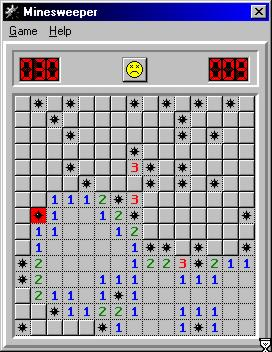



## A Minesweeper windows replica

### Description

this is pretty close to the windows version. it pretty much has all the features, i think. it even employs the little-known double click clear that most of the minesweepers on psc seem to lack. i don't think there are any bugs left. the code pretty basic. i use bitblt and some recursion and simple file I/O. let me know what you think. thanks
 
### More Info
 

             |
---                |---
**Submitted On**   |2004-05-10 12:13:32
**By**             |[john hollister](https://github.com/Planet-Source-Code/PSCIndex/blob/master/ByAuthor/john-hollister.md)
**Level**          |Advanced
**User Rating**    |5.0 (10 globes from 2 users)
**Compatibility**  |VB 6\.0
**Category**       |[Games](https://github.com/Planet-Source-Code/PSCIndex/blob/master/ByCategory/games__1-38.md)
**World**          |[Visual Basic](https://github.com/Planet-Source-Code/PSCIndex/blob/master/ByWorld/visual-basic.md)
**Archive File**   |[A\_Mineswee1743855102004\.zip](https://github.com/Planet-Source-Code/john-hollister-a-minesweeper-windows-replica__1-53694/archive/master.zip)

